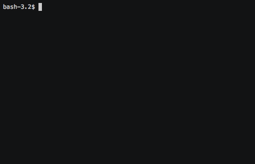

# Clone project -  Generator differences!

[](https://codeclimate.com/github/Viacheslav80/backend-project-lvl2/maintainability)
[](https://codeclimate.com/github/Viacheslav80/backend-project-lvl2/test_coverage)
[](https://travis-ci.org/Viacheslav80/backend-project-lvl2)

## installing
 
build the pocket.

```
$ uses_folder/make publish 
```
install pocket of global

```
$ uses_folder/npm link
```


Use to compare:

```
$ gendiff <any_file>.json  <any_file2>.json 
```


```
$ gendiff <any_file>.yml  <any_file2>.yml
```



```
$ gendiff <any_file>.ini  <any_file2>.ini
```


Compare deep files:

```
$ gendiff <deep_file>.json <dep_file2>.json
```


